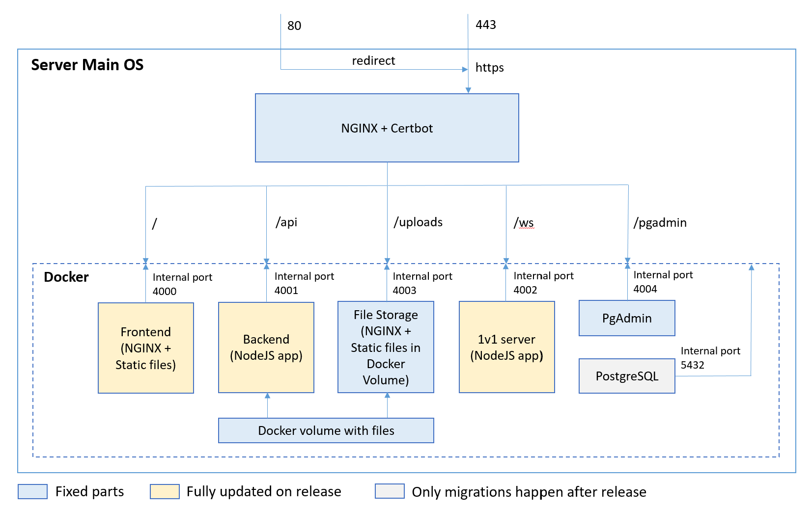

# Dfcomps.ru

This is a repository for storing everything related to dfcomps.ru site, which is dedicated to hosting Quake III Defrag tournaments. Feel free to contribute or just join our awesome community and send your demos :)

For anyone interested in contributing, there is a trello board with the list of planned tasks for dfcomps: [https://trello.com/b/kKv83NJL/dfcomps](https://trello.com/b/kKv83NJL/dfcomps).

# Quick start

The repository consists of several applications which are managed by [Nx Workspaces](https://nx.dev/). Every app is written in [Typescript](https://www.typescriptlang.org/), recommended version of [NodeJS](https://nodejs.org/) is 18.x. To develop backend locally, you need to install [Docker](https://www.docker.com/) for working with database. Before running any projects locally, you need to install npm packages: 

```bash
npm i
```

## Frontend

Main site frontend written in [Angular](https://angular.io/). To start frontend project locally:

```bash
npm run frontend
```

By default, frontend is using backend from main dfcomps.ru site, to switch to local backend use

```bash
npm run frontend-local
```

Connection to different backends is managed in [url-params.config](https://github.com/deniskond/dfcomps.ru/blob/master/apps/frontend/src/shared/rest-api/business/url-params.config.ts#L5) and also in proxy.conf files ([prod](https://github.com/deniskond/dfcomps.ru/blob/master/apps/frontend/proxy.conf.json) and [local](https://github.com/deniskond/dfcomps.ru/blob/master/apps/frontend/proxy.conf.local.json))

## Database

There is a [PostgreSQL](https://www.postgresql.org/) database using [TypeORM](https://typeorm.io) for migrations and [PgAdmin](https://www.pgadmin.org/) for database management. To setup database make sure Docker is installed and running, then execute this script once:

```bash
npm run database:setup
```

After that, you will have PostgreSQL working on port 5432 with test database and PgAdmin working on port 4004. To access database via PgAdmin:
- Open PgAdmin frontend http://localhost:4004
- Login as test user Login: admin@admin.com, Password: admin
- Right click on Servers -> Register -> Server
- Input any name at General tab
- At Connection tab input this fields:
```bash
Host name/address: local_pgdb
Port: 5432
Maintenance database: postgres
Username: user
Password: admin
```
- After clicking save you should be able to access dfcomps test database. 

The database itself is obfuscated replica of prod database without user sensitive information like logins, passwords and discord tags.

## Backend

Main site backend written in [NestJS](https://nestjs.com/). To start backend project locally you need to first ensure that you have local version of database initialized (as described in previous section). Start script:

```bash
npm run backend
```

## 1v1 Server
Websocket server specially designed for 1v1 pick/bans and matchmaking. Written in pure Typescript using [Express](https://expressjs.com/). To start server locally:

```bash
npm run 1v1-server
```

Websocket interaction between client and server is pretty complex, so there is 100% coverage of all use cases by end-to-end tests. Make sure that all new functionality also is covered by end-to-end tests and all tests are passing by running:

```bash
npm run 1v1-server:test
```

## Testing

There are several test users in test database, each of them representing the access role. 
```
Login: superadmin Password: superadmin
Login: admin Password: admin
Login: validator Password: validator
Login: cup_organizer Password: cup_organizer
Login: newsmaker Password: newsmaker
Login: user Password: user
Login: moderator Password: moderator
Login: streamer Password: streamer
```

There are end-to-end tests written in [Cypress](https://www.cypress.io/), which can be run by commands
```bash
npm run e2e
npm run e2e-single # edit the test name in this script & run single test
```
Test cases:
```
☑ 1. Adding simple news
☑ 2. Editing simple news
☑ 3. Deleting news
☑ 4. Adding offline cup
☑ 5. Editing offline cup
☑ 6. Adding start offline cup news
☑ 7. Editing start offline cup news
☑ 8. Adding offline cup result news
☑ 9. Editing offline cup result news
☑ 10. Adding online cup announce news
☑ 11. Adding online cup result news
☐ 12. Adding multicup result news
☑ 13. Adding streamers result news
☐ 14. Uploading valid demo with overbounces turned off
☐ 15. Uploading valid demo with overbounces turned on
☐ 16. Uploading invalid demo
☐ 17. Validation (validators archive + setting results in admin)
☐ 18. Finishing cup (distribution of rating + making cup archive)
☑ 19. Deleting offline cup
☑ 20. Adding multicup
☑ 21. Editing multicup
☐ 22. Adding multicup round with custom map
☐ 23. Editing multicup round with custom map
☐ 24. Deleting multicup round with custom map
☑ 25. Deleting multicup
☑ 26. Adding online cup
☑ 27. Editing online cup
☐ 28. Online cup with server logs
☐ 29. Online cup with manual results
☑ 30. Deleting online cup
☐ 31. Ending season
☐ 32. Updating profile
```

## Discord bot
Designed to bring some dfcomps functionality to discord channels. Currently is not used and is in deprecated state. To run locally:

```bash
npm run discord-bot
```

# Server scheme

Everything related to server scheme is stored in `build` folder, main part of which is `build/base-nginx.conf`. Visual interpretation of nginx config and server scheme:

